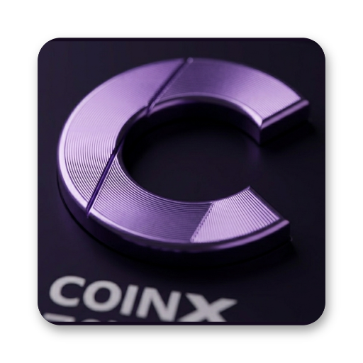
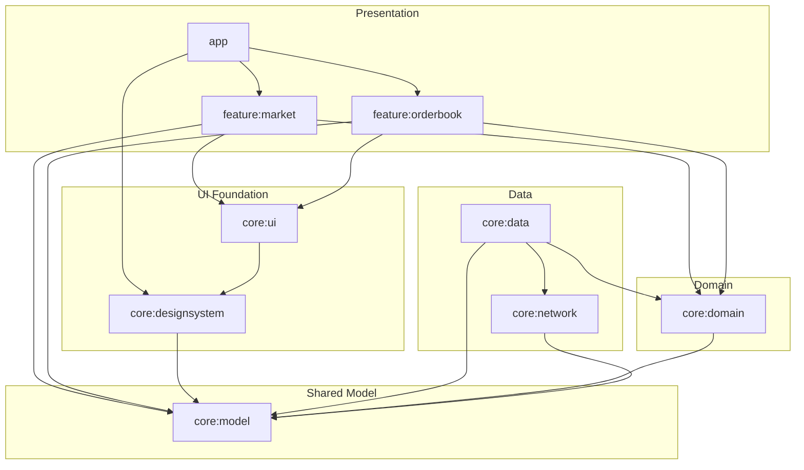
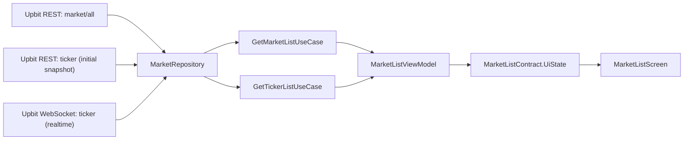
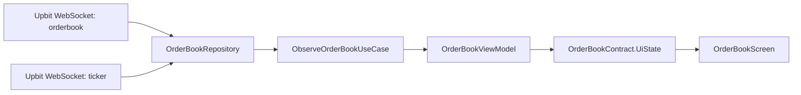

<div align="center">
  

  <h1>코인엑스</h1>
  <p><strong>Upbit 기반 실시간 종목 리스트 + 호가창 Android 앱</strong></p>
  <p>KRW / BTC / USDT 마켓 리스트, 실시간 Order Book, 연결 상태 대응을 Jetpack Compose로 구현한 사전 과제 프로젝트입니다.</p>

  <p>
    
    
    
    
    
    
  </p>
</div>

---

## Overview

### 핵심 기능
- REST 초기 조회 + WebSocket 갱신으로 KRW / BTC / USDT 마켓 종목 리스트 제공
- 현재가와 24시간 변동률 표시
- WebSocket 기반 실시간 호가창 갱신
- 검색 / 정렬 / 마켓 탭 전환 지원
- 오프라인 / 로딩 / 소켓 오류 상태 분리
- 호가 잔량 기반 시각 효과와 가격 변화 하이라이트 적용

### 요구사항 대응

| 항목 | 구현 상태 | 비고 |
|---|---|---|
| 종목 리스트 | 완료 | `market/all` + REST `ticker` 초기 조회 + WebSocket `ticker` 갱신 |
| 호가창 | 완료 | 매수 / 매도 호가 + 현재가 표시 |
| 실시간 갱신 | 완료 | 호가창은 WebSocket만 사용 |
| 에러 / 로딩 / 오프라인 UI | 완료 | 전역 스낵바 + 화면별 상태 분리 |
| 테스트 코드 | 완료 | Repository / ViewModel 단위 테스트 |

---

## Preview

<table>
  <tr>
    <td width="50%" valign="top">
      <strong>Market List Overview</strong><br />
      KRW / BTC / USDT 탭 전환과 가격 변화 하이라이트<br /><br />
      
    </td>
    <td width="50%" valign="top">
      <strong>Search & Sort</strong><br />
      검색, 정렬, 리스트 탐색 흐름<br /><br />
      
    </td>
  </tr>
  <tr>
    <td width="50%" valign="top">
      <strong>Realtime Order Book</strong><br />
      실시간 호가 갱신, 현재가, depth 표현<br /><br />
      
    </td>
    <td width="50%" valign="top">
      <strong>Offline & Retry</strong><br />
      오프라인 상태, 소켓 오류, 재시도 흐름<br /><br />
      
    </td>
  </tr>
</table>

---

## Why Upbit

사전 과제의 핵심은 “종목 리스트 + 실시간 호가창”을 가장 명확하게 구현할 수 있는 거래소를 고르는 것이었습니다.

### Comparison

| 거래소     | KRW 마켓                  | 한글 종목명           | WebSocket `orderbook` | 호가 단(段) 유연성                          | 최종 판단  |
|---------|-------------------------|------------------|-----------------------|--------------------------------------|--------|
| Upbit   | 제공                      | 제공               | 지원                    | `orderbook_units`로 5/10/15/30단 선택 가능 | **선택** |
| Bithumb | 제공                      | 제공               | 지원                    | 30단 고정                               | 보류     |
| Korbit  | 제공                      | **미제공** (영문 심볼만) | 지원                    | 고정                                   | 제외     |
| Binance | **미제공** (USDT 페어 우회 필요) | 미제공              | 지원                    | 다양                                   | 제외     |

### Decision

사실 Upbit와 Bithumb은 핵심 기능(KRW 마켓, 한글 종목명, WebSocket `orderbook`/`ticker`)이 거의 동등합니다. 둘 중 어느 쪽을 골라도 과제
요구사항은 충족할 수 있는 구조였습니다.

Upbit를 선택한 이유는 두 가지입니다.

1. **호가 단 수를 유연하게 받을 수 있어 화면 설계 자유도가 높았다.** Upbit는 `orderbook_units` 파라미터로 5/10/15/30단 중 선택해 받을 수
   있고, 이번 과제에서는 15단을 기본으로 두고 더 다채로운 호가 표현이 가능하도록 여지를 남겨 뒀습니다. Bithumb은 30단 고정이라 화면에서 잘라 표시해야 합니다.
2. **국내 거래량 1위로 사용자 환경과 가장 가깝다.** 실시간 호가가 가장 활발하게 움직이는 거래소에서 검증하면 UI 갱신 정책(샘플링 100ms, depth 표현 등)을
   실제 부하 기준으로 잡기 좋습니다.

Korbit과 Binance는 각각 한글 종목명 미제공, KRW 마켓 미제공으로 과제 범위에 맞지 않아 제외했습니다.

### Used APIs

- `GET /v1/market/all`
- `GET /v1/ticker`
- `wss://api.upbit.com/websocket/v1` `orderbook`
- `wss://api.upbit.com/websocket/v1` `ticker`

---

## Architecture

이 프로젝트는 `Clean Architecture + MVVM`를 사용합니다.

- `feature` 계층은 화면과 ViewModel을 담당합니다.
- `domain` 계층은 repository contract와 use case를 담당합니다.
- `data` 계층은 REST / WebSocket / connectivity 구현을 담당합니다.
- `model` 계층은 여러 모듈에서 공통으로 쓰는 순수 모델을 담당합니다.
- `designsystem` / `ui` 계층은 재사용 가능한 Compose 테마와 UI 조각을 담당합니다.

### Module Graph

아래 그래프는 MVVM + Clean Architecture 기준의 모듈 계층과 주요 참조 방향을 나타냅니다.



### Dependency Rules

- `app`은 Composition Root로서 Navigation과 전역 UI만 조립합니다.
- `feature:*`는 Presentation 계층으로 `core:domain`, `core:ui`, `core:model`만 참조합니다.
- `core:data`는 Data 계층으로 `core:domain` contract를 구현하고 `core:network`를 사용합니다.
- `core:model`은 모든 계층이 공유하는 가장 아래의 순수 모델 모듈로 유지합니다.

### Module Responsibilities

| Module | Responsibility |
|---|---|
| `app` | Application, Activity, Navigation3 NavHost, 전역 네트워크 스낵바 |
| `core:model` | `Market`, `Ticker`, `MarketType`, `NetworkAvailability`, `ConnectionState` |
| `core:domain` | repository contract, use case, `OrderBookEvent` |
| `core:network` | Upbit REST / WebSocket DTO와 클라이언트 |
| `core:data` | repository 구현, mapper, connectivity 구현, Hilt binding |
| `core:designsystem` | Compose theme, color, typography, spacer 등 공통 디자인 토큰 |
| `core:ui` | `MarketIcon` 같은 재사용 Compose UI 컴포넌트 |
| `feature:market` | 종목 리스트, 검색, 정렬, 탭 전환, 가격 변화 하이라이트 |
| `feature:orderbook` | 실시간 호가창, 연결 상태 UI, 재시도, depth 애니메이션 |

### State Flow Strategy

| Screen | Input | State |
|---|---|---|
| Market List | REST `ticker` 초기 조회 + WebSocket `ticker` + connectivity | `items + uiStatus` |
| Order Book | WebSocket `orderbook` + `ticker` + connectivity | `marketInfo + orderBookData + uiStatus` |

### Data Flow

> 두 화면 모두 **'WebSocket으로 받은 프레임을 이전 상태에 누적'**하는 같은 패턴이지만, 화면 성격에 따라 누적 연산자와 throttling 전략을 다르게
> 골랐습니다.
>
> | Screen | 초기 데이터 | 실시간 | 누적 | Throttling | 재구독 |
> |---|---|---|---|---|---|
> | Market List | REST `market/all` + REST `ticker` snapshot | WebSocket `ticker` 변경분 | `scan` (종목별 최신가 누적) | 없음 (변경 빈도 낮음) | `WhileSubscribed(5s)` |
> | Order Book | WebSocket 진입 즉시 구독 | WebSocket `orderbook` + `ticker` | `runningFold` (`OrderBookEvent` immutable copy) | `sample(100ms)` | `flatMapLatest` + `refreshTrigger` |

#### Market List



#### Order Book



### UI / Error Policy

- `MarketList`는 오프라인 상태를 `OFFLINE`, 초기 시세 조회 또는 실시간 ticker 연결 실패를 `ERROR`로 분리합니다.
- `OrderBook`는 `InitialLoading`, `SocketError`, `Offline`, `Idle` 상태를 분리합니다.
- 앱 루트에서는 네트워크 단절 시 전역 스낵바를 1회 노출합니다.
- 호가창 화면은 오프라인과 소켓 오류를 서로 다른 오버레이로 표현합니다.
- `OrderBookRepositoryImpl`은 `IOException`에 대해 `1초 -> 2초 -> 3초` 제한적 backoff 재시도를 수행합니다.

### Tradeoffs — 일부러 안 한 것들

클린 아키텍처 / MVVM이 도그마처럼 적용되지 않도록, 과제 규모에 맞게 의도적으로 **하지 않은** 결정도 정리합니다.

| 일부러 안 한 것                               | 이유                                                                                                     |
|-----------------------------------------|--------------------------------------------------------------------------------------------------------|
| UseCase에 도메인 규칙 억지로 채우기                 | ViewModel 테스트 시 mock 대상을 인터페이스(UseCase) 한 곳으로 고정하고, 도메인 규칙이 추가될 때 그 자리에 자연스럽게 채울 수 있도록 함               |
| State Holder 패턴 추가 도입                   | 현재 화면 복잡도라면 ViewModel + Compose `remember`로 충분. 추상화 레이어를 한 단 더 얹는 비용 대비 이득이 작다고 판단                     |
| 풀 MVI 컨벤션 (uiState/uiEvent/uiEffect 3종) | MVVM 베이스에 `UiStatus` sealed로 MVI 느낌만 차용. 화면 복잡도 대비 풀 컨벤션은 과함                                           |
| Robolectric 도입                          | 클린 아키텍처 분리 덕분에 ViewModel은 UseCase mock, UseCase는 Repository 인터페이스 mock으로 JUnit + MockK + Turbine만으로 충분 |

**얻은 것**: 라이브러리 교체에 강한 구조, ViewModel을 JUnit만으로 테스트 가능, 멀티 모듈 incremental 빌드 시간 단축.

### Known Limitation & Next Step

- 현재 `retryWhen`은 **`IOException` 자식만** 재시도합니다.
- WebSocket 경로에서는 OkHttp가 `SocketTimeoutException`, `ConnectException`, `EOFException`, 핸드셰이크 단계의
  `ProtocolException`(서버 4xx/5xx 거절)까지 모두 `IOException`으로 묶어 던지므로 한 줄로 사실상 다 커버됩니다.
- 다만 `MarketRepositoryImpl`의 **REST 초기 호출 경로**에서는 `retrofit2.HttpException`(5xx)이 `IOException`이
  아니므로 5xx 일시 장애가 재시도 없이 실패합니다.
- **다음 작업 1순위**: `sealed RetryDecision`을 도입해 `IOException`과 `HttpException(5xx)`은 retry, 4xx /
  `SerializationException` / `CancellationException`은 그대로 propagate되도록 분기를 넓힐 예정입니다.

---

## Libraries

| Library | Used For | Reason |
|---|---|---|
| Jetpack Compose + Material3 | UI | 종목 리스트와 호가창처럼 상태 변화가 잦은 화면을 선언형 UI로 다루기 좋았고, 로딩/에러/오프라인 상태를 `UiState` 기준으로 분리해 표현하기 쉬웠습니다 |
| Navigation3 | 화면 전환 | 종목 선택 시 `OrderBookNavKey`를 통해 args를 타입 안전하게 전달할 수 있었고, 엔트리 단위 상태 복원과 ViewModel 스코프 분리도 현재 화면 구조와 잘 맞았습니다 |
| Hilt | DI | `core:data`, `core:domain`, `feature:*` 모듈 간 의존성을 단순하게 연결할 수 있었고, Dagger 기반으로 Android 생명주기에 맞춰 인스턴스를 관리해 주는 점이 현재 구조와 잘 맞았습니다 |
| Retrofit | REST API | Upbit REST API인 `market/all`, `ticker` 호출을 명확한 인터페이스로 구성하기 좋았고, DTO와 mapper를 분리한 data 계층 구조와도 잘 맞았습니다 |
| OkHttp WebSocket | 실시간 스트림 | Retrofit과 같은 네트워크 스택을 유지하면서 WebSocket을 직접 제어할 수 있어, 실시간 호가/현재가 스트림과 재연결 처리를 일관되게 구현하기 좋았습니다 |
| kotlinx.serialization | JSON 직렬화 | REST와 WebSocket DTO를 같은 방식으로 직렬화/역직렬화할 수 있었고, Kotlin의 nullability와 default value를 데이터 모델에 자연스럽게 반영할 수 있어 응답 모델 관리가 단순했습니다 |
| Kotlin Coroutines / Flow | 비동기 처리 | 종목 리스트 초기 snapshot과 실시간 ticker 스트림, connectivity 관찰, 호가창 WebSocket 수신을 같은 비동기 추상화로 다룰 수 있었고, `StateFlow`와 `callbackFlow` 조합이 현재 구조와 잘 맞았습니다 |
| Coil 3 | 코인 아이콘 로딩 | 종목 리스트의 코인 아이콘을 Compose에서 가볍게 표시하기 좋았고, OkHttp 기반 네트워크 스택과도 자연스럽게 연결할 수 있었습니다 |
| MockK + Turbine + JUnit4 | 테스트 | repository와 ViewModel을 격리해 검증하기 쉬웠고, Flow 상태 전이, retry, 오프라인/소켓 오류 시나리오를 읽기 쉬운 형태로 테스트할 수 있었습니다 |

### Why Not The Alternatives?

| 비교 항목 | 이번 선택 | 고려한 대안 | 이번 과제에서 제외한 이유 |
|---|---|---|---|
| UI | Jetpack Compose | XML View + Fragment | 상태 변화가 많은 리스트/호가창 화면을 더 적은 보일러플레이트로 구성할 수 있었고, 과제 요구 스택과도 일치했습니다 |
| Navigation | Navigation3 | Navigation Compose | 단순 화면 이동 자체는 둘 다 가능했지만, args를 `Serializable` key로 타입 안전하게 전달하고 엔트리 단위 상태를 복원하는 구조가 현재 앱의 `OrderBookNavKey` 흐름에 더 잘 맞았습니다 |
| DI | Hilt | Koin | Koin은 러닝커브가 얕고 사용이 편리하지만, 이번 과제에서는 Google의 Dagger 기반인 Hilt가 Android 생명주기에 맞춰 인스턴스를 생성·관리해 주는 점이 더 편리했고, 멀티 모듈과 ViewModel 주입 흐름도 더 안정적으로 가져갈 수 있었습니다 |
| REST + WebSocket | Retrofit + OkHttp WebSocket | Ktor Client | Ktor 하나로 통합할 수도 있었지만, 이번 과제에서는 REST와 WebSocket을 각각 가장 익숙하고 검증된 조합으로 가져가는 편이 구현과 디버깅이 더 단순했습니다 |
| Serialization | kotlinx.serialization | Gson / Moshi | Kotlin 데이터 모델과의 결합이 자연스럽고, nullability와 default value를 모델에 그대로 반영하기 쉬워 REST와 WebSocket DTO를 일관된 방식으로 관리할 수 있었습니다 |
| 비동기 | Coroutines / Flow | RxJava | Android 기본 생태계와 더 자연스럽게 맞고, `StateFlow`, `SharedFlow`, `callbackFlow`만으로 필요한 상태 스트림을 충분히 표현할 수 있었습니다 |
| 이미지 로딩 | Coil 3 | Glide / Fresco | 복잡한 이미지 파이프라인보다 작은 코인 아이콘 표시가 주 목적이어서, Compose 친화성과 설정 단순성이 더 중요했습니다 |
| 테스트 더블 / Flow 검증 | MockK + Turbine + JUnit4 | Mockito + 직접 수집 코드 / JUnit5 | Kotlin 코드와 suspend/Flow 테스트를 더 간결하게 작성할 수 있었고, 현재 Android 테스트 셋업과도 가장 마찰이 적었습니다 |

---

## Product Decisions

| 항목 | 결정 |
|---|---|
| 지원 마켓 | KRW / BTC / USDT |
| 종목 리스트 갱신 | REST `/v1/ticker` 초기 조회 + WebSocket `ticker` 증분 반영 |
| 호가창 갱신 | WebSocket only |
| 기본 호가 단위 | 15단 |
| 가격 포맷 | KRW는 정수 그룹 포맷, BTC/USDT는 최대 소수점 9자리 |
| 수치 타입 | `Double` 유지 |
| 호가창 렌더링 주기 | `100ms` 제한 (성능과 UX의 최적화) |
| Preview 전략 | `src/debug`에 화면 상태별 Compose Preview 유지 |

### 호가창 UI 렌더링 주기 최적화 (100ms)

웹소켓을 통해 실시간으로 쏟아지는 오더북(호가창) 데이터를 그대로 UI에 그릴 경우 심각한 성능 저하가 발생합니다. 이를 방지하기 위해 데이터 샘플링 주기를 **100ms**(`OrderBookSample`)로 제한하는 아키텍처 결정을 내렸습니다.

1. **UX(사용자 경험) 향상**: 인간의 시각은 100ms(0.1초) 이하의 빠른 텍스트 변화를 제대로 인지하지 못합니다. 제한 없이 렌더링이 발생하면 글자가 뭉개져 보이는 플리커링(Flickering) 현상으로 인해 시각적 피로도만 높아집니다.
2. **성능과 배터리 효율**: 초당 수백 번 데이터가 갱신될 때마다 Compose의 불필요한 Recomposition이 발생하여 배터리가 소모됩니다.
3. **비즈니스의 본질 보장**: 암호화폐 투자자에게 100ms의 시차는 지연을 느끼기 어려운 '실시간성(Real-time)'으로 간주되면서도 투자 타이밍을 뺏지 않는 마지노선입니다.

이러한 성능과 비즈니스 요구사항의 Trade-off를 고려하여, Coroutines Flow의 연산자를 통해 이벤트를 100ms 단위로 Sampling하여 UI 렌더링을 최적화했습니다.

### 왜 종목 리스트는 REST + WebSocket인가

종목 리스트와 호가창은 요구하는 실시간성의 성격이 다르다고 판단해 데이터 수집 전략을 분리했습니다.

- 종목 리스트는 최초 진입 시 REST `ticker`로 빠르게 초기 snapshot을 구성합니다.
- 그 이후에는 Upbit WebSocket `ticker`를 구독해 종목별 최신 현재가와 변동률을 실시간으로 반영합니다.
- 호가창은 기존과 동일하게 WebSocket `orderbook` + `ticker` 조합으로 실시간 상태를 유지합니다.

이 방식은 리스트 첫 렌더링 속도와 이후 실시간성 사이의 균형을 맞추기 위한 선택입니다. 초기 현재가는 REST 응답으로 빠르게 채우고, 이후 변경분만 WebSocket으로 반영하므로 1초 polling 대비 네트워크 사용량과 불필요한 전체 재조회 비용을 줄일 수 있습니다.

현재 종목 리스트 스트림도 `StateFlow`와 `SharingStarted.WhileSubscribed(5_000)` 위에서 동작하므로, 화면 구독이 끊기면 약 5초 뒤 수집이 중단됩니다. 연결 복구 시에는 초기 snapshot을 다시 받고 WebSocket을 재구독해 최신 상태를 복원합니다.

---

## Troubleshooting

### Upbit Ticker REST API의 400 Bad Request 에러 대응

- **문제 상황**: 초기 시세(Snapshot)를 조회하기 위해 `market/all`로 가져온 수많은 마켓 코드(약 300개 이상)를 `GET /v1/ticker?markets=...` 요청에 한 번에 묶어서 보냈을 때 `400 Bad Request` 에러가 간헐적으로 발생했습니다.
- **원인 분석**: 웹 서버(Tomcat 등)나 방화벽은 보안상 URL의 최대 길이(보통 4KB 내외)를 제한하고 있습니다. 모든 코인 종목을 URI Parameter로 연결하면 문자열이 너무 길어져 서버가 요청을 거부하는 것이 문제였습니다.
- **해결 방법**: 
  - `MarketRepositoryImpl` 내부에서 마켓 리스트를 **100개 단위로 자르는 Chunking**을 추가했습니다.
  - Kotlin Coroutines의 `async` 배열과 `awaitAll()`을 결합하여, 분할된 청크 단위의 요청들을 병렬로 호출한 뒤 클라이언트에서 `flatten()`으로 하나로 병합하여 반환하도록 설계했습니다.
- **아키텍처적 의도**: 이 URL 길이 제한이라는 'REST API의 한계'를 ViewModel이 알게 된다면 계층 규칙이 무너지게 됩니다. 따라서 이를 Repository 내부에 캡슐화하여, 호출하는 ViewModel 입장에선 내부가 Chunk로 잘렸는지 모른 채 투명하게 호출할 수 있도록 유지보수성을 확보했습니다.

---

## Testing

### Covered Scenarios
- `OrderBookRepositoryImplTest`
  - WebSocket frame 병합
  - 제한적 backoff 재시도
  - error payload 전이
- `NetworkStatusRepositoryImplTest`
  - connectivity flow 초기값과 전이
- `MarketListViewModelTest`
  - 초기 로딩 / 온라인 실패 / retry / WebSocket ticker 반영
- `OrderBookViewModelTest`
  - 누적 `OrderBookEvent` 기반 상태 전이
  - `SocketError`, `Offline`, retry

### Verification Commands

```bash
./gradlew testDebugUnitTest
./gradlew assembleDebug
```

---

## Build & Run

### Quick Install

- APK
  다운로드: [coinx_v1.1.1.apk](https://github.com/daryeou/crypto-orderbook/releases/download/v1.1.1/coinx_v1.1.1.apk)
- Android 기기에서 설치 후 바로 실행할 수 있습니다.

### Environment

- Min SDK: 26
- Target SDK: 36
- JDK: 21
- Gradle Wrapper: 8.13

### Build From Source

```bash
./gradlew testDebugUnitTest
./gradlew assembleDebug
```

Windows에서는 `gradlew.bat`를 사용합니다. 빌드 결과물은 `app/build/outputs/apk/debug/` 아래에 생성됩니다.

---

## Commit Convention

[Conventional Commits](https://www.conventionalcommits.org/) 규칙을 따르며, `feat` / `fix` / `perf` / `refactor` / `docs` / `chore` 등 타입으로 변경 의도를 분리해 기록합니다.

---

## Documents

- [`docs/사전과제.md`](./docs/사전과제.md)
- [`docs/DEVELOPMENT_PLAN.md`](./docs/DEVELOPMENT_PLAN.md)
- [`ROADMAP.md`](./ROADMAP.md)
- [`RETROSPECTIVE.md`](./RETROSPECTIVE.md)
- [`AGENTS.md`](./AGENTS.md)
