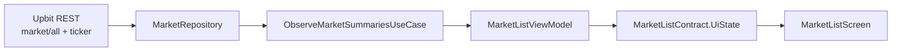
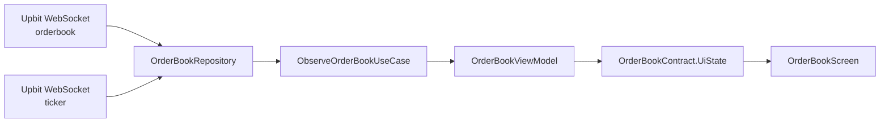
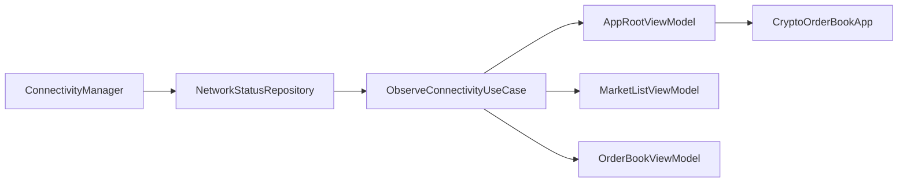

# Crypto Order Book (Android)

Upbit 공개 API를 사용해 KRW 마켓 종목 리스트와 실시간 호가창을 제공하는 Android 앱입니다.

## 빌드 & 실행

### 환경
- 최소 SDK: 26
- 타깃 SDK: 36
- JDK: 21
- 빌드 도구: Gradle Wrapper 8.13

### 명령

```bash
./gradlew testDebugUnitTest
./gradlew assembleDebug
```

Windows에서는 `gradlew.bat`를 사용합니다.

## 거래소 선택 근거

이 과제에서 비교한 기준은 다음과 같습니다.

- 종목 리스트 조회 방식이 단순한가
- 호가 WebSocket을 안정적으로 지원하는가
- 현재가를 어떤 API 조합으로 채워야 하는지 명확한가
- KRW 마켓을 직접 제공하는가
- 문서와 응답 구조 해석 비용이 낮은가
- 국내 환경에서 바로 검증하기 쉬운가

| 거래소 | 종목 리스트 조회 | 호가 WebSocket | 현재가 채우기 방식 | KRW 마켓 | 문서 / 응답 해석 난이도 | 국내 환경 검증 |
|---|---|---|---|---|---|---|
| Upbit | `market/all` + `ticker` 조합이 단순함 | 지원 | `orderbook` + `ticker` 역할 분리가 명확함 | 제공 | 낮음 | 쉬움 |
| Bithumb | KRW 친화적이지만 응답 구조 해석 비용이 더 큼 | 지원 | 현재가/호가 조합은 가능하지만 응답 형태 해석 부담이 있음 | 제공 | 중간 | 쉬움 |
| Binance | 문서는 풍부하지만 과제 관점에선 심볼 체계와 시장 구성이 더 큼 | 지원 | 조합은 유연하지만 과제 범위에 비해 복잡도 높음 | 직접 제공하지 않음 | 중간 | 상대적으로 불리 |

선택: Upbit

선택 이유:
- `market/all + ticker + orderbook + ticker` 조합이 명확해 과제 요구사항과 바로 연결됩니다.
- KRW 마켓을 직접 제공하므로 종목 리스트와 호가창 검증이 직관적입니다.
- 국내 환경에서 WebSocket과 REST를 모두 바로 테스트하기 쉽습니다.
- 문서와 응답 구조가 비교적 단순해 구현 및 회고 문서화에 유리합니다.

사용 API:
- 종목 메타데이터: `GET /v1/market/all`
- 현재가 / 24h 변동률: `GET /v1/ticker`
- 실시간 호가: `wss://api.upbit.com/websocket/v1` `orderbook`
- 실시간 현재가: `wss://api.upbit.com/websocket/v1` `ticker`

## 아키텍처

이 프로젝트는 과제 규모에 맞춘 `Clean Architecture + MVVM + StateFlow`를 사용합니다.

```text
app
  -> feature:market / feature:orderbook
       -> core:domain
            -> core:data
                 -> core:network
                 -> core:model
```

### 모듈 역할

- `app`: Application, Activity, Navigation3 NavHost, 전역 오프라인 UI
- `core:model`: 순수 모델
- `core:domain`: repository contract, use case
- `core:network`: REST / WebSocket DTO와 클라이언트
- `core:data`: repository 구현과 Hilt binding
- `feature:market`: 종목 리스트 화면과 ViewModel
- `feature:orderbook`: 호가창 화면과 ViewModel

### 상태 관리

- `MarketList`는 `Loading / Error / Success` 형태의 `MarketListContract.UiState`를 사용합니다.
- `OrderBook`는 `meta + content + uiStatus` 구조의 `OrderBookContract.UiState`를 사용합니다.
  - `meta`: 종목 정보
  - `content`: 현재 렌더링 가능한 호가/현재가/등락률
  - `uiStatus`: `IDLE`, `INITIAL_LOADING`, `SOCKET_ERROR`, `OFFLINE`
- `Route`와 `Screen`을 분리합니다.
  - `Route`: Hilt 주입, 상태 수집, 액션 전달
  - `Screen`: 순수 UI 렌더링
- `MarketListViewModel`과 `OrderBookViewModel`은 `SharedFlow<Unit> + flatMapLatest + stateIn(WhileSubscribed)` 패턴으로 새로고침과 수집 생명주기를 관리합니다.
- `OrderBookViewModel`은 repository가 누적해 전달한 `OrderBookPayload`와 `NetworkAvailability`를 결합해 최종 `UiState`를 만듭니다.

### Navigation

- `Navigation3`의 `rememberNavBackStack`, `NavDisplay`를 사용합니다.
- `rememberSaveableStateHolderNavEntryDecorator()`와 `rememberViewModelStoreNavEntryDecorator()`로 엔트리 단위 저장 상태와 ViewModel 스코프를 분리합니다.
- `OrderBook`는 `OrderBookNavKey`를 Hilt assisted injection으로 ViewModel에 전달합니다.

## 구현 순서와 검증 흐름

이 프로젝트는 화면을 처음부터 완성형으로 만들기보다, 최소 동작을 먼저 확인한 뒤 구조와 정책을 보강하는 순서로 진행했습니다.

### 1. 거래소/API 검토
- 작업: Upbit REST / WebSocket 스펙 확인, 거래소 비교 기준 정리
- 목적: 과제 범위에서 구현 비용이 가장 낮은 거래소 선택
- 검증: REST 호출 가능 여부, WebSocket 호가/현재가 지원 여부 확인

### 2. 앱 구조 구성
- 작업: 멀티 모듈 구조, Navigation3, Hilt 기반 진입 구조 구성
- 목적: 이후 기능을 얹을 최소 실행 구조 확보
- 검증: 앱 빌드, 화면 이동, ViewModel 주입 동작 확인

### 3. 종목 리스트 연결
- 작업: `market/all` + `ticker` 기반 종목 리스트 화면 구현
- 목적: Must-have 1 우선 달성
- 검증: KRW 마켓 목록, 현재가, 24시간 변동률 표시 확인

### 4. 호가창 최소 동작 구현
- 작업: WebSocket `orderbook` + `ticker` 병합, 현재가 포함 호가창 구현
- 목적: Must-have 2, 3의 핵심 동작 먼저 확보
- 검증: 종목 선택 후 실시간 호가/현재가 갱신 확인

### 5. 상태 정책 정리
- 작업: contract 기반 `UiState`, use case, assisted injection, 오프라인 정책 정리
- 목적: 프로토타입 수준 동작을 유지하면서 구조와 책임 분리 강화
- 검증: 화면 상태 전이, 재시도, 연결 복구 동작 확인

### 6. 테스트와 문서 보강
- 작업: ViewModel / repository 테스트 추가, README / ROADMAP / RETROSPECTIVE 갱신
- 목적: 구현뿐 아니라 검증 과정과 설계 판단을 제출물에 반영
- 검증: `testDebugUnitTest`, `assembleDebug` 통과

요약하면 `거래소/API 검토 -> 앱 구조 구성 -> 기능 연결 -> 상태 정책 정리 -> 테스트 및 문서 보강` 흐름입니다.

## 데이터 흐름

### 종목 리스트



### 호가창



### 전역 네트워크 상태



## 오프라인 처리 정책

- 오프라인은 화면 에러가 아니라 앱 전역 상태로 다룹니다.
- `NetworkStatusRepository.observeConnectivity()`가 `NetworkAvailability`를 제공합니다.
- 연결 여부는 `activeNetwork` 존재만으로 판단하지 않고, `NetworkCapabilities`의 `NET_CAPABILITY_INTERNET`와 `NET_CAPABILITY_VALIDATED`를 함께 확인합니다.
  - `NET_CAPABILITY_INTERNET`: 인터넷용 네트워크인지
  - `NET_CAPABILITY_VALIDATED`: 실제 외부 인터넷 연결이 검증됐는지
- `MainActivity -> CryptoOrderBookApp` 루트에서 연결 상태를 관찰합니다.
- 연결이 끊기면:
  - Snackbar를 1회 표시합니다.
  - 반투명 오버레이와 중앙 로딩 인디케이터를 띄웁니다.
  - 현재 화면의 마지막 상태는 유지하고, REST polling / WebSocket 갱신만 중단합니다.
- 연결이 복구되면 활성 화면이 자동으로 재조회 또는 재구독합니다.

화면별 에러 정책:
- `MarketList`: 온라인 상태에서 REST polling이 실패할 때만 `Error`
- `OrderBook`: 온라인 상태에서 WebSocket 연결이 실패할 때만 `Error(SOCKET)`

## 주요 라이브러리

| 라이브러리 | 용도 | 선택 근거 |
|---|---|---|
| Jetpack Compose | UI | 과제 필수, Route/Screen 분리에 적합 |
| Navigation3 | 화면 이동 | serializable key 기반 back stack과 엔트리 단위 상태 복원 |
| Hilt | DI | 모듈 간 repository / network binding을 단순하게 유지 |
| Retrofit | REST API | Upbit REST 클라이언트 구성이 간결함 |
| OkHttp WebSocket | 실시간 호가 / 현재가 | `callbackFlow` 래핑에 적합 |
| kotlinx.serialization | JSON 직렬화 | REST / WS 모델을 일관되게 처리 가능 |
| Coroutines / Flow | 비동기 처리 | StateFlow, callbackFlow, 테스트 도구와 궁합이 좋음 |
| JUnit4 | 단위 테스트 실행 | Android 단위 테스트 기본 구성이 단순함 |
| MockK | 테스트 더블 | repository / client mocking이 편함 |
| Turbine | Flow 검증 | 순차 이벤트 검증, collect 타이밍 제어, retry / 재구독 시나리오 검증이 쉬워 ViewModel과 repository 테스트에 적합 |

## 가정과 판단

- 종목 리스트는 KRW 마켓만 표시합니다.
- 리스트의 현재가와 24시간 변동률은 REST `/v1/ticker` polling으로 갱신합니다.
- 호가창은 REST polling 없이 WebSocket만 사용합니다.
- 호가 수량은 기본 15단으로 구독합니다.
- Compose Preview는 `src/debug`에만 둡니다.
- ViewModel 인터페이스는 두지 않고 fake repository와 stateless screen으로 테스트 seam을 확보합니다.
- 수치 타입은 `Double`을 유지했습니다. 공개 API가 `Double` 기반이고, 현재 범위에서는 화면 표시 수준의 정밀도만 필요하므로 BigDecimal 계열 도입은 생략했습니다.

## 테스트 전략

- `OrderBookRepositoryImplTest`: WebSocket frame 병합과 error payload 전이 검증
- `NetworkStatusRepositoryImplTest`: connectivity flow 초기값과 전이 검증
- `MarketListViewModelTest`: 초기 로딩, 온라인 실패, 오프라인 유지, 자동 polling 재개, retry 검증
- `OrderBookViewModelTest`: 누적 payload 기반 `UiState(meta + content + uiStatus)`, 온라인 socket 실패, 오프라인 유지, retry 검증

## 검증 결과

- `./gradlew testDebugUnitTest` 통과
- `./gradlew assembleDebug` 통과

## 관련 문서

- [`docs/DEVELOPMENT_PLAN.md`](./docs/DEVELOPMENT_PLAN.md)
- [`ROADMAP.md`](./ROADMAP.md)
- [`RETROSPECTIVE.md`](./RETROSPECTIVE.md)
- [`docs/사전과제.md`](./docs/사전과제.md)
- [`AGENTS.md`](./AGENTS.md)

## 다음 작업

- `MarketListViewModel` 상태 구조를 현재 `OrderBookViewModel` 정리 방향과 비교해 단순화 여부를 점검합니다.
- 그 다음 종목 리스트와 호가창의 전체 UI, 세부 기능, 표현 방식을 정리합니다.
